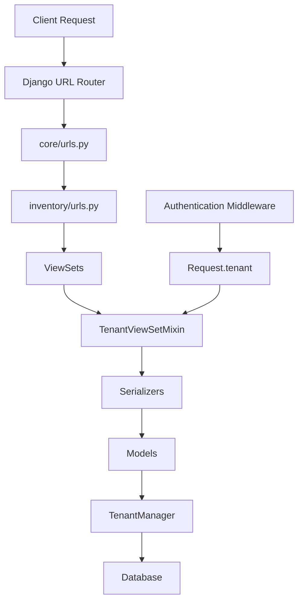
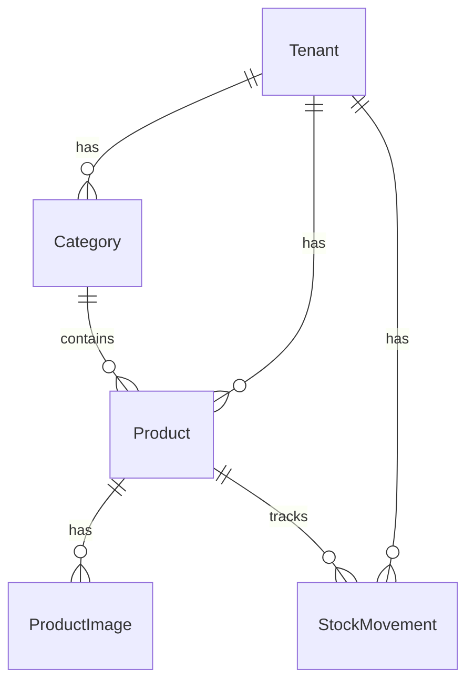

# Inventory API Endpoints Documentation

This document provides a comprehensive list of all API endpoints created for the inventory management system, including their locations, functionality, and how they work.

---

## Base URL

All inventory endpoints are prefixed with:
```
/api/inventory/
```

This is configured in [core/urls.py](file:///d:/Projects/BOS/business-backend/core/urls.py#L33)

---

## 1. Category Endpoints

**ViewSet**: `CategoryViewSet`  
**Location**: [inventory/views.py](file:///d:/Projects/BOS/business-backend/inventory/views.py#L17-L26)  
**Model**: [Category](file:///d:/Projects/BOS/business-backend/inventory/models.py#L5-L30)  
**Serializer**: [CategorySerializer](file:///d:/Projects/BOS/business-backend/inventory/serializers.py#L4-L14)  
**URL Registration**: [inventory/urls.py](file:///d:/Projects/BOS/business-backend/inventory/urls.py#L11)

### Available Endpoints

| Method | Endpoint | Description |
|--------|----------|-------------|
| GET | `/api/inventory/categories/` | List all categories for the tenant |
| POST | `/api/inventory/categories/` | Create a new category |
| GET | `/api/inventory/categories/{id}/` | Retrieve a specific category |
| PUT | `/api/inventory/categories/{id}/` | Update a category (full) |
| PATCH | `/api/inventory/categories/{id}/` | Update a category (partial) |
| DELETE | `/api/inventory/categories/{id}/` | Delete a category |

### Features
- **Search**: Search by category `name`
- **Tenant Isolation**: Automatically filters categories by logged-in user's tenant
- **Permissions**: Requires authentication and tenant user permission
- **Auto-Assignment**: Automatically assigns tenant on creation

### Request/Response Fields
```json
{
  "category_id": 1,
  "name": "Electronics",
  "description": "Electronic items and gadgets",
  "status": "active",
  "created_at": "2025-12-04T10:30:00Z"
}
```

---

## 2. Product Endpoints

**ViewSet**: `ProductViewSet`  
**Location**: [inventory/views.py](file:///d:/Projects/BOS/business-backend/inventory/views.py#L27-L48)  
**Model**: [Product](file:///d:/Projects/BOS/business-backend/inventory/models.py#L33-L98)  
**Serializer**: [ProductSerializer](file:///d:/Projects/BOS/business-backend/inventory/serializers.py#L16-L61)  
**URL Registration**: [inventory/urls.py](file:///d:/Projects/BOS/business-backend/inventory/urls.py#L12)

### Available Endpoints

| Method | Endpoint | Description |
|--------|----------|-------------|
| GET | `/api/inventory/products/` | List all products for the tenant |
| POST | `/api/inventory/products/` | Create a new product |
| GET | `/api/inventory/products/{id}/` | Retrieve a specific product |
| PUT | `/api/inventory/products/{id}/` | Update a product (full) |
| PATCH | `/api/inventory/products/{id}/` | Update a product (partial) |
| DELETE | `/api/inventory/products/{id}/` | Delete a product |
| GET | `/api/inventory/products/{id}/stock-history/` | Get stock movement history for a product |

### Features
- **Search**: Search by `name`, `sku`, or `brand`
- **Filtering**: Filter by `category`, `subcategory`, or `status`
- **Ordering**: Order by `selling_price` or `current_stock`
- **Tenant Isolation**: Automatically filters products by logged-in user's tenant
- **Permissions**: Requires authentication and tenant user permission
- **Validation**: Ensures category and subcategory belong to the same tenant
- **Stock Protection**: `current_stock` is read-only and can only be updated via StockMovement

### Custom Actions

#### Stock History
**Endpoint**: `/api/inventory/products/{id}/stock-history/`  
**Method**: GET  
**Description**: Returns all stock movements for a specific product, ordered by date (newest first)

**Response Example**:
```json
[
  {
    "movement_id": 1,
    "type": "IN",
    "quantity": 100,
    "reference_type": "Purchase Order",
    "reason": "Initial stock",
    "date": "2025-12-04T10:30:00Z",
    "product_name": "iPhone 15"
  }
]
```

### Request/Response Fields
```json
{
  "product_id": 1,
  "name": "iPhone 15",
  "sku": "IPH15-128-BLK",
  "brand": "Apple",
  "category": 1,
  "subcategory": null,
  "purchase_price": "65000.00",
  "selling_price": "79900.00",
  "mrp": "79900.00",
  "current_stock": 50,
  "low_stock_alert": 10,
  "hsn_code": "85171200",
  "gst_percent": "18.00",
  "status": "active",
  "created_at": "2025-12-04T10:30:00Z"
}
```

---

## 3. Product Image Endpoints

**ViewSet**: `ProductImageViewSet`  
**Location**: [inventory/views.py](file:///d:/Projects/BOS/business-backend/inventory/views.py#L51-L57)  
**Model**: [ProductImage](file:///d:/Projects/BOS/business-backend/inventory/models.py#L100-L116)  
**Serializer**: [ProductImageSerializer](file:///d:/Projects/BOS/business-backend/inventory/serializers.py#L63-L67)  
**URL Registration**: [inventory/urls.py](file:///d:/Projects/BOS/business-backend/inventory/urls.py#L13)

### Available Endpoints

| Method | Endpoint | Description |
|--------|----------|-------------|
| GET | `/api/inventory/product-images/` | List all product images for the tenant |
| POST | `/api/inventory/product-images/` | Upload a new product image |
| GET | `/api/inventory/product-images/{id}/` | Retrieve a specific product image |
| PUT | `/api/inventory/product-images/{id}/` | Update a product image |
| PATCH | `/api/inventory/product-images/{id}/` | Update a product image (partial) |
| DELETE | `/api/inventory/product-images/{id}/` | Delete a product image |

### Features
- **Tenant Isolation**: Filters images by products belonging to the tenant
- **Permissions**: Requires tenant user permission
- **File Upload**: Supports image file uploads to `product_images/` directory

### Request/Response Fields
```json
{
  "image_id": 1,
  "product": 1,
  "image": "/media/product_images/iphone15.jpg",
  "created_at": "2025-12-04T10:30:00Z"
}
```

---

## 4. Stock Movement Endpoints

**ViewSet**: `StockMovementViewSet`  
**Location**: [inventory/views.py](file:///d:/Projects/BOS/business-backend/inventory/views.py#L60-L70)  
**Model**: [StockMovement](file:///d:/Projects/BOS/business-backend/inventory/models.py#L118-L162)  
**Serializer**: [StockMovementSerializer](file:///d:/Projects/BOS/business-backend/inventory/serializers.py#L69-L83)  
**URL Registration**: [inventory/urls.py](file:///d:/Projects/BOS/business-backend/inventory/urls.py#L14)

### Available Endpoints

| Method | Endpoint | Description |
|--------|----------|-------------|
| GET | `/api/inventory/stock-movements/` | List all stock movements for the tenant |
| GET | `/api/inventory/stock-movements/{id}/` | Retrieve a specific stock movement |

> [!IMPORTANT]
> This is a **READ-ONLY** ViewSet. Stock movements cannot be created, updated, or deleted via the API directly. They are typically created automatically by the system during sales, purchases, or manual adjustments.

### Features
- **Filtering**: Filter by `product` or `type`
- **Ordering**: Order by `date` (default: newest first)
- **Tenant Isolation**: Filters movements by products belonging to the tenant
- **Permissions**: Requires authentication and tenant user permission
- **Read-Only**: No POST, PUT, PATCH, or DELETE operations allowed

### Movement Types
```python
MOVEMENT_TYPES = (
    ("IN", "Stock In"),
    ("OUT", "Stock Out"),
    ("SALE", "Stock Deducted for Sale"),
    ("RETURN", "Stock Added for Return"),
)
```

### Request/Response Fields
```json
{
  "movement_id": 1,
  "type": "IN",
  "quantity": 100,
  "reference_type": "Purchase Order",
  "reason": "Initial stock purchase",
  "date": "2025-12-04T10:30:00Z",
  "product_name": "iPhone 15"
}
```

---

## How the System Works

### Architecture Overview



### Key Components

#### 1. URL Routing
- Main URL configuration: [core/urls.py](file:///d:/Projects/BOS/business-backend/core/urls.py#L33)
- Inventory URLs: [inventory/urls.py](file:///d:/Projects/BOS/business-backend/inventory/urls.py)
- Uses Django REST Framework's `DefaultRouter` for automatic endpoint generation

#### 2. ViewSets
- **TenantViewSetMixin**: Provides automatic tenant filtering
- **ModelViewSet**: Full CRUD operations (Create, Read, Update, Delete)
- **ReadOnlyModelViewSet**: Only Read operations (List, Retrieve)

#### 3. Permissions
- **IsAuthenticated**: User must be logged in
- **IsTenantUser**: User must belong to a tenant (not superadmin)

#### 4. Tenant Isolation
All inventory data is automatically isolated by tenant:
- Uses `TenantManager` for queryset filtering
- `TenantViewSetMixin` ensures only tenant's data is accessible
- Automatic tenant assignment on creation via `perform_create()`

#### 5. Data Validation
- Category and subcategory must belong to the same tenant
- SKU must be unique per tenant
- Stock can only be modified via StockMovement records

---

## Authentication

All endpoints require JWT authentication. Include the access token in the request header:

```
Authorization: Bearer <access_token>
```

The tenant is automatically determined from the authenticated user's profile.

---

## Error Handling

### Common Error Responses

**401 Unauthorized**
```json
{
  "detail": "Authentication credentials were not provided."
}
```

**403 Forbidden**
```json
{
  "detail": "You do not have permission to perform this action."
}
```

**404 Not Found**
```json
{
  "detail": "Not found."
}
```

**400 Bad Request**
```json
{
  "field_name": ["Error message"]
}
```

---

## Database Models

### Relationships



### Key Features
- **Tenant Foreign Keys**: All models have tenant relationships for data isolation
- **TenantManager**: Custom manager ensures queries are automatically filtered by tenant
- **Unique Constraints**: SKU unique per tenant, category name unique per tenant
- **Indexes**: Optimized for tenant-based queries

---

## File Locations Summary

| Component | File Path |
|-----------|-----------|
| URL Configuration | [inventory/urls.py](file:///d:/Projects/BOS/business-backend/inventory/urls.py) |
| ViewSets | [inventory/views.py](file:///d:/Projects/BOS/business-backend/inventory/views.py) |
| Models | [inventory/models.py](file:///d:/Projects/BOS/business-backend/inventory/models.py) |
| Serializers | [inventory/serializers.py](file:///d:/Projects/BOS/business-backend/inventory/serializers.py) |
| Main URL Config | [core/urls.py](file:///d:/Projects/BOS/business-backend/core/urls.py) |

---

## Testing the Endpoints

### Example: Create a Category
```bash
curl -X POST http://localhost:8000/api/inventory/categories/ \
  -H "Authorization: Bearer <access_token>" \
  -H "Content-Type: application/json" \
  -d '{
    "name": "Electronics",
    "description": "Electronic items",
    "status": "active"
  }'
```

### Example: List Products with Filters
```bash
curl -X GET "http://localhost:8000/api/inventory/products/?category=1&search=iphone&ordering=-selling_price" \
  -H "Authorization: Bearer <access_token>"
```

### Example: Get Stock History
```bash
curl -X GET http://localhost:8000/api/inventory/products/1/stock-history/ \
  -H "Authorization: Bearer <access_token>"
```

---

## Summary

The inventory system provides **4 main resource endpoints**:

1. **Categories** - Full CRUD with search
2. **Products** - Full CRUD with search, filtering, ordering, and stock history
3. **Product Images** - Full CRUD for image management
4. **Stock Movements** - Read-only tracking of inventory changes

All endpoints are:
- ✅ Tenant-isolated
- ✅ JWT authenticated
- ✅ RESTful
- ✅ Automatically filtered by tenant
- ✅ Validated for cross-tenant data access
